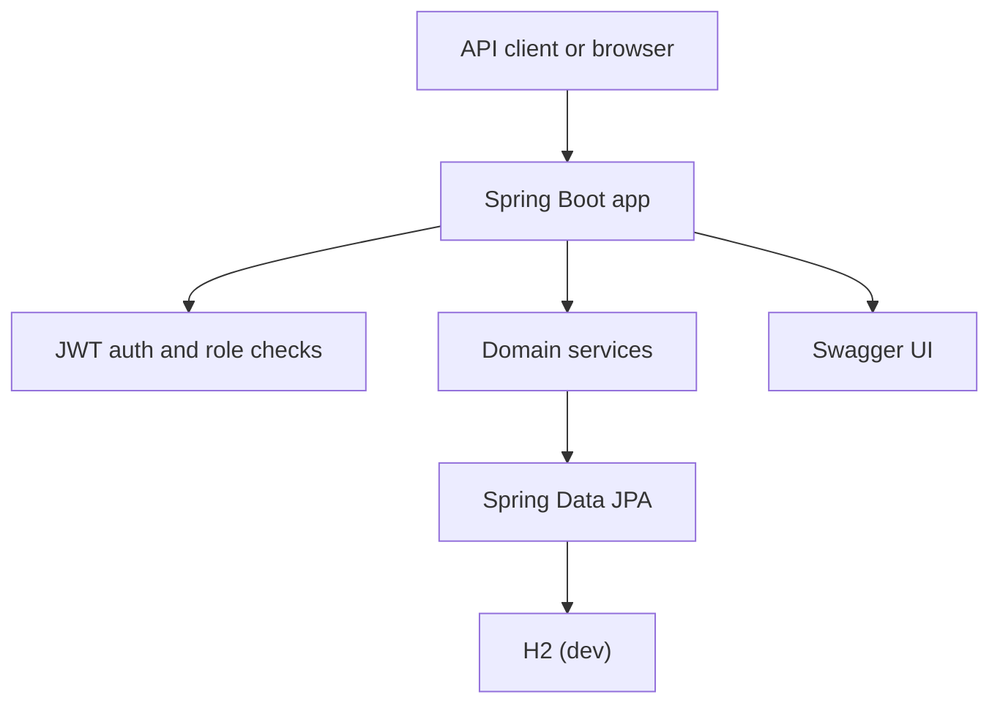

# Architecture Overview

The system exposes REST endpoints for auth, advice management, and ratings.  
Security is stateless with JWT. H2 is used in dev; code is ready for a production RDBMS.

```mermaid
flowchart TD
  Client["API client or browser"] --> API["Spring Boot app"]
  API --> Security["JWT auth and role checks"]
  API --> Services["Domain services"]
  Services --> Repos["Spring Data JPA"]
  Repos --> DB["H2 (dev)"]
  API --> OpenAPI["Swagger UI"]
```

